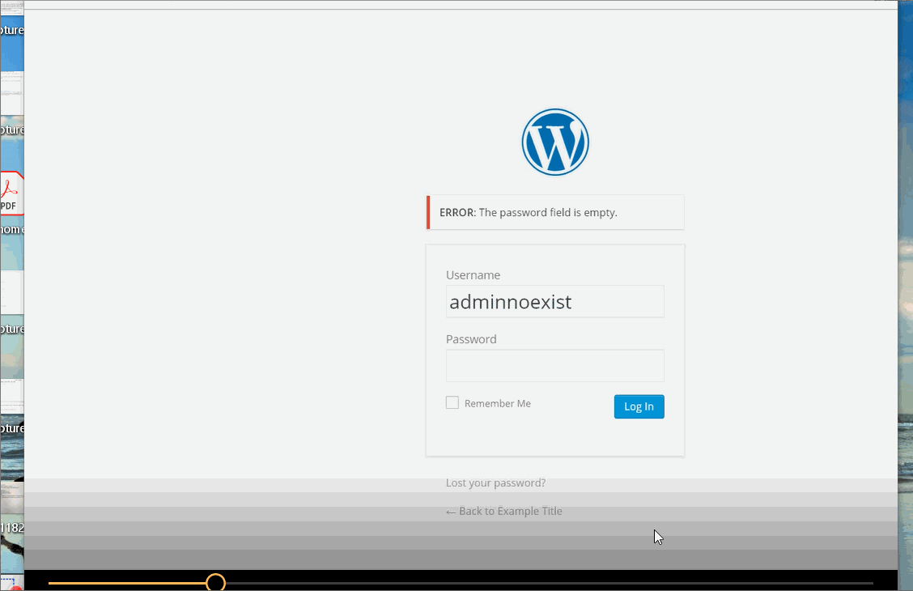

# Project 7 and 8 - WordPress Pentesting

Time spent: **10** hours spent in total

> Objective: Find, analyze, recreate, and document **3 vulnerabilities** affecting an old version of WordPress

## Pentesting Report

1. (Required) Vulnerability Name or ID: Authenticated Stored Cross-Site Scripting(XSS1)
  - [x] Summary: 
    - Vulnerability types: XSS
    - Tested in version: 4.2
    - Fixed in version: 4.2.4
  - [x] GIF Walkthrough: 
    - 
  - [x] Steps to recreate: 
    - Create a new post, and then put this code ```<a href="[caption code=">]</a><a title =" onmouseover=alert('Exploit1Rona!')  "> dont click the link.</a>``` in the content link. Finally click link to show message in the preview of post.
  - [x] Affected source code:
    - [Link 1](https://core.trac.wordpress.org/browser/branches/4.2/src/wp-includes/class-wp-editor.php?rev=33361)

2. (Required) Vulnerability Name or ID: User Enumeration
  - [x] Summary: 
    - Vulnerability types: User Enumeration
    - Tested in version: 4.2
    - Fixed in version: 4.2.4
  - [x] GIF Walkthrough: 
     - 
     - 
  - [x] Steps to recreate: 
    - Go to the WordPress login page, when you input admin as username and empty password field, then it shows the error which is the   password field is empty. When you input admin as username and randomly input password, then it shows the error which is the password you entered for the username admin is incorrect.  When you randomly input both username and password, then it shows the error which is invalid username, or by running this command on KALI  --enumeration u.
  - [x] Affected source code:
    - [Link 2](https://www.wpwhitesecurity.com/wordpress-security/wordpress-username-disclosure-vulnerability/)

3. (Required) WordPress 4.1-4.2.1 - Unauthenticated Genericons Cross-Site Scripting (XSS)
  - [x] Summary: 
    - Vulnerability types: XSS
    - Tested in version: 4.1-4.2.1
    - Fixed in version: 4.2.2
  - [x] GIF Walkthrough: 
    - 
  - [x] Steps to recreate: 
    - View a new post, and insert code ```http:// site.com/wp-content/themes/twentyfifteen/genericons/example.html#1``` and just hit the preview post. Then it shows 1 when the next window pops up.
  - [x] Affected source code:
    - [Link 3]


## Assets

List any additional assets, such as scripts or files

## Resources

- [WordPress Source Browser](https://core.trac.wordpress.org/browser/)
- [WordPress Developer Reference](https://developer.wordpress.org/reference/)

GIFs created with [LiceCap](http://www.cockos.com/licecap/).

## Notes

Describe any challenges encountered while doing the work
